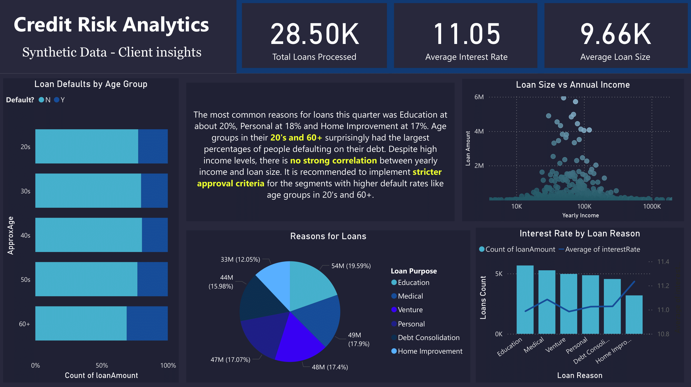

# 📊 Credit Risk Analysis Dashboard

The dashboard helps provide insight into loan distributions, trends in credit behavior, age group segments and loan purpose, helping support targeted lending strategies and risk-based pricing decisions. This [data](https://www.kaggle.com/datasets/laotse/credit-risk-dataset) is also fully synthetic.

---

## Dataset Description

The dataset contains the attributes for loan applicants:

| Column               | Description                                     |
|----------------------|-------------------------------------------------|
| `Age`                | Age of applicant                                |
| `annualIncome`       | Yearly income                                   |
| `creditHistoryLength`| Years of credit history                         |
| `currentLoanDefault` | 1 if borrower defaulted on current loan         |
| `pastLoanDefault`    | 1 if borrower defaulted on previous loans       |
| `employmentLength`   | Years of employment                             |
| `homeOwnership`      | Ownership status (Own, Rent, etc.)              |
| `interestRate`       | Interest rate for the loan                      |
| `loanAmount`         | Amount of loan                                  |
| `LoanSize`           | Size category of the loan                       |
| `loanIntent`         | Purpose of the loan (e.g., education, medical)  |

 

## Dashboard

